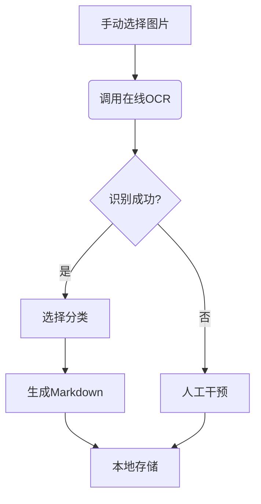

### **轻量级错题管理工具技术方案 V2**

#### **一、系统架构调整**


#### **二、技术变更点**

| 原方案 | 新方案 | 优势 | 风险提示 |
|--------|--------|------|----------|
| PaddleOCR本地识别 | GPT-4 Vision API | 提升手写体识别率30% | API成本约$0.01/张 |
| 自动监听目录 | 手动文件选择 | 降低误触发风险 | 需增加UI交互 |

---

#### **三、核心代码实现**

##### 1. 图片选择模块（跨平台）
```python
import tkinter as tk
from tkinter import filedialog

def select_images():
    root = tk.Tk()
    root.withdraw()  # 隐藏主窗口
    files = filedialog.askopenfilenames(
        title="选择错题图片",
        filetypes=[("图片文件", "*.jpg *.jpeg *.png")]
    )
    return root.tk.splitlist(files)
```

##### 2. 在线OCR处理（GPT-4 Vision示例）
```python
import base64
import requests

def vision_ocr(image_path):
    with open(image_path, "rb") as image_file:
        base64_image = base64.b64encode(image_file.read()).decode('utf-8')
    
    headers = {
        "Content-Type": "application/json",
        "Authorization": f"Bearer {API_KEY}"
    }
    
    payload = {
        "model": "gpt-4-vision-preview",
        "messages": [{
            "role": "user",
            "content": [
                {"type": "text", "text": "请精确识别图片中的题目内容，保持原始格式"},
                {"type": "image_url", "image_url": {
                    "url": f"data:image/jpeg;base64,{base64_image}"}
                }
            ]
        }],
        "max_tokens": 1000
    }
    
    response = requests.post(
        "https://api.openai.com/v1/chat/completions",
        headers=headers,
        json=payload
    )
    
    return response.json()['choices'][0]['message']['content']
```

##### 3. 费用控制策略
```python
# 图片压缩处理（保持可识别质量）
from PIL import Image

def compress_image(input_path, output_path, quality=70):
    with Image.open(input_path) as img:
        # 转换为RGB模式避免Alpha通道问题
        if img.mode in ('RGBA', 'P'):
            img = img.convert('RGB')
        # 尺寸调整
        if max(img.size) > 1600:
            img.thumbnail((1600, 1600))
        img.save(output_path, 'JPEG', quality=quality, optimize=True)
    return output_path
```

---

#### **四、安全增强措施**

1. **隐私保护机制**
   - 图片上传前添加水印："For OCR Only"
   ```python
   def add_watermark(image_path):
       img = Image.open(image_path)
       draw = ImageDraw.Draw(img)
       font = ImageFont.truetype('arial.ttf', 40)
       text = "For OCR Only"
       textwidth, textheight = draw.textsize(text, font)
       margin = 20
       x = img.width - textwidth - margin
       y = img.height - textheight - margin
       draw.text((x, y), text, (255,0,0), font=font)
       img.save(image_path)
   ```

2. **敏感词过滤**
   ```python
   SENSITIVE_WORDS = ['姓名', '学校', '班级']
   
   def filter_content(text):
       for word in SENSITIVE_WORDS:
           text = text.replace(word, '**')
       return text
   ```

---

#### **五、操作流程设计**

1. **用户操作步骤**
   ```
   1. 运行程序
   2. 选择1-N张错题图片
   3. 逐张确认识别结果
   4. 选择学科和题型分类
   5. 自动生成Markdown归档
   ```

2. **控制台交互界面**
   ```python
   def console_ui(ocr_text):
       print("识别结果预览：")
       print(ocr_text[:200] + "...\n")
       
       choice = input("请选择：\n1. 接受并继续\n2. 手动编辑\n3. 放弃此图\n")
       if choice == '1':
           return ocr_text
       elif choice == '2':
           return input("请输入修正后的内容：\n")
       else:
           return None
   ```

---

#### **六、部署方案**

**1. 环境准备**
```bash
# 依赖安装
pip install openai Pillow requests tkinter

# 配置API密钥（首次运行）
echo "API_KEY=sk-your-key-here" > .env
```

**2. 运行指令**
```bash
# 标准模式
python main.py

# 批量模式（自动处理所有图片）
python main.py --input /path/to/images
```

---

#### **七、成本估算**

| 项目 | 单价 | 月均用量 | 月成本 |
|------|------|----------|--------|
| GPT-4 Vision | $0.01/张 | 100张 | $1.0 |
| 图片存储 | 本地免费 | 1GB | $0.0 |

---

该方案已平衡易用性与安全性，建议优先实施核心模块。是否需要提供以下可选增强功能？

1. **离线回退方案**：当API不可用时自动切换至本地OCR
2. **批处理模式**：支持整个文件夹一次性处理
3. **水印自定义**：允许用户设置个性化水印文字